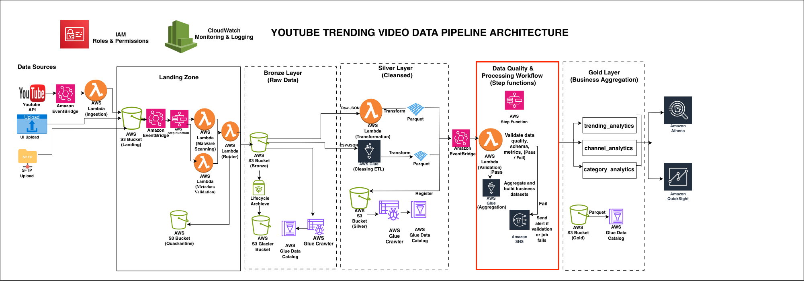

# YouTube Trending Video Data Pipeline


An end-to-end serverless data pipeline that ingests YouTube trending video
statistics from multiple sources, governs and validates files through a
landing zone, cleanses and transforms data through Bronze, Silver and Gold
layers following the medallion architecture, and produces business analytics
ready for Amazon Athena and QuickSight.

---

## Architecture



The pipeline follows the **medallion architecture** (Bronze → Silver → Gold)
with two independent workflows — Workflow 1 handles per-file ingestion and
governance through the Landing Zone, Workflow 2 handles scheduled
transformation and data quality validation before writing to the Gold layer.

---

## Data Sources

Data enters the pipeline from three sources:

| Source | Method | Description |
|---|---|---|
| YouTube Data API | AWS Lambda (scheduled) | Fetches live trending video statistics daily |
| Kaggle CSV dataset | UI Upload / SFTP / AWS CLI | Historical trending video data uploaded manually |
| SFTP Upload | SFTP client | Bulk file transfers from external systems |

All sources land files in the **Landing Zone S3 bucket** before any
processing begins. No data goes directly to Bronze.

---

## Tech Stack

| Service | Purpose |
|---|---|
| AWS S3 | Data lake storage (Landing, Bronze, Silver, Gold, Quarantine) |
| AWS Lambda | API ingestion, malware scanning, metadata validation, routing, data quality |
| AWS Step Functions | Workflow orchestration for ingestion and data quality |
| AWS Glue Crawler | Cataloging Bronze and Silver S3 data |
| AWS Glue ETL Jobs | Bronze→Silver cleansing and Silver→Gold aggregation |
| AWS Glue Workflow | Scheduling and chaining crawler and ETL jobs |
| Amazon EventBridge | Event-driven triggers between pipeline stages |
| Amazon EventBridge Scheduler | Daily schedule for API ingestion and Glue Workflow |
| Amazon SNS | Failure alerts via email |
| Amazon Athena | SQL analytics on Gold layer |
| Amazon QuickSight | Business intelligence dashboards |
| AWS IAM | Roles and permissions for all services |
| Amazon CloudWatch | Monitoring and logging across all services |

---

## Pipeline Overview

### Workflow 1 — Ingestion (fires per file)

```
Data Source (YouTube API / CSV Upload / SFTP)
    → Landing Zone S3
        → EventBridge (Object Created)
            → Step Functions Workflow 1
                ├── Malware Scanning Lambda     ← rejects infected files
                ├── Metadata Validation Lambda  ← rejects invalid file structure
                └── Router Lambda
                        ├── CLEAN + VALID → Bronze S3
                        └── INFECTED / INVALID → Quarantine S3
```

### Workflow 2 — Transformation (runs daily at 2am UTC)

```
Glue Workflow (scheduled 2am UTC)
    → Glue Crawler          ← catalogs Bronze S3
        → Bronze→Silver Job ← cleanses, deduplicates, writes Parquet
            → Silver S3
                → EventBridge (Object Created)
                    → Step Functions Workflow 2
                        → Data Quality Lambda (13 checks)
                            ├── PASS → Silver→Gold Glue Job
                            │           → Gold S3 (trending, channel, category analytics)
                            └── FAIL → SNS Alert
```

---

## Project Structure

```
youtube-trending-video-data-pipeline/
├── README.md
├── data
├── architecture/
│   └── architecture-diagram.png
├── glue_jobs/
│   ├── bronze_to_silver.py          ← cleansing and schema enforcement
│   └── silver_to_gold.py            ← business aggregations
├── glue_workflows/
│   └── transformation_workflow.json ← Glue Workflow definition
├── lambda/
│   ├── api_ingestion/
│   │   └── lambda_function.py       ← fetches data from YouTube API
│   ├── malware_scanning/
│   │   └── lambda_function.py       ← scans files for malware
│   ├── metadata_validator/
│   │   └── lambda_function.py       ← validates file schema and structure
│   ├── router/
│   │   └── lambda_function.py       ← routes files to Bronze or Quarantine
│   └── data_quality/
│   |   └── lambda_function.py       ← runs 13 data quality checks on Silver
    ├── json_to_parquet/
│   │   └── lambda_function.py       ← converts JSON reference data to Parquet
├── step_functions/
│   ├── ingestion_workflow.json      ← Workflow 1 ASL definition
│   └── data_quality_workflow.json   ← Workflow 2 ASL definition
├── script_to_upload_csv/
│   └── upload_to_s3.sh              ← push CSV to Landing Zone via AWS CLI
├── eventbridge/
│   ├── landing_zone_rule.json       ← triggers Workflow 1 on file landing
│   └── silver_to_dq_rule.json       ← triggers Workflow 2 on Silver S3 write
├── iam/
│   └── policies/
│       ├── lambda-router-policy.json
│       ├── lambda-data-quality-policy.json
│       ├── glue-job-policy.json
│       └── step-functions-policy.json
└── docs/
    ├── architecture.md              ← design decisions and component details
    ├── setup.md                     ← step-by-step deployment guide
    ├── pipeline_flow.md             ← detailed walkthrough of each stage
    └── troubleshooting.md           ← common errors and fixes
```

---

## Gold Layer Outputs

The pipeline produces three analytics-ready tables in the Gold layer:

| Table | Description |
|---|---|
| `trending_analytics` | Daily trending summaries per region — views, likes, engagement |
| `channel_analytics` | Channel performance metrics — peak views, times trending, rank |
| `category_analytics` | Category-level trends over time — view share percentage per region |

All tables are stored as Parquet with Snappy compression, partitioned by
region, and registered in the Glue Data Catalog for querying via Athena.

---

## Prerequisites

- AWS Account with appropriate IAM permissions
- Python 3.14
- AWS CLI configured (`aws configure`)
- YouTube Data API v3 key

---

## Quick Setup

1. Clone the repository
```bash
git clone https://github.com/abbeylink/youtube-trending-video-data-pipeline.git
cd youtube-trending-video-data-pipeline
```

2. Create S3 buckets — rename `abbey` to something unique for your account
```bash
aws s3 mb s3://abbey-youtube-data-pipeline-landing-zone
aws s3 mb s3://abbey-youtube-data-pipeline-bronze
aws s3 mb s3://abbey-youtube-data-pipeline-silver
aws s3 mb s3://abbey-youtube-data-pipeline-gold
aws s3 mb s3://abbey-youtube-data-pipeline-quarantine
aws s3 mb s3://abbey-youtube-data-pipeline-athena-results
```

3. Set up IAM roles and attach policies from the `iam/policies/` folder.
   See [docs/setup.md](docs/setup.md) for full role configuration.

4. Upload Glue scripts
```bash
aws s3 cp glue_jobs/bronze_to_silver.py \
  s3://aws-glue-assets-{account-id}-us-east-1/scripts/abbey-youtube-data-pipeline-bronze-to-silver.py

aws s3 cp glue_jobs/silver_to_gold.py \
  s3://aws-glue-assets-{account-id}-us-east-1/scripts/abbey-youtube-data-pipeline-silver-to-gold.py
```

5. Follow the detailed setup guide in [docs/setup.md](docs/setup.md)

> **Important:** Replace `{account-id}` with your AWS account ID and
> `{ACCOUNT_ID}` placeholder in all IAM policy files before deploying.

---

## Uploading Data Manually

For Kaggle CSV datasets or bulk uploads, place files in the Landing Zone:

**Via AWS Console:**
```
S3 → abbey-youtube-data-pipeline-landing-zone
→ youtube/raw_statistics/region=xx/
→ Upload your CSV or JSON files
```

**Via AWS CLI:**

Use the provided shell script — change to the `script_to_upload_csv/`
directory and run:
```bash
cd script_to_upload_csv
./upload_to_s3.sh
```

**Via SFTP:**
```
Upload files to the configured SFTP endpoint
Files land automatically in the Landing Zone S3 bucket
```

All files go through malware scanning and metadata validation before
reaching Bronze. Corrupt or infected files are moved to Quarantine
and an SNS alert is sent.

---

## Monitoring

| Service | Where to check |
|---|---|
| Step Functions | Step Functions → State machines → Executions |
| Glue Workflow | Glue → Workflows → Run history |
| Glue Jobs | Glue → Jobs → Run history |
| Lambda | CloudWatch → Log groups → /aws/lambda/function-name |
| EventBridge | EventBridge → Rules → Monitoring tab |
| Alerts | Email via SNS subscription |

---

## Lessons Learned

- Glue crawler generates scattered hash-suffixed tables when mixed file
  formats (CSV and JSON) coexist in the same S3 prefix — solved by enabling
  `Create a single schema for each S3 path` and setting the correct table level
- `awswrangler.athena.read_sql_query()` requires an explicit `s3_output`
  parameter — relying on workgroup default causes a 404 bucket error
- Pandas operations return `numpy.bool_` not Python `bool` — wrapping in
  `bool()` is required before JSON serialisation in Lambda
- The `aws-glue-assets` bucket must never be emptied — it contains all
  Glue job scripts
- Landing Zone is essential for governance — never write directly to Bronze
  from a data source
- Ingestion and transformation workflows must be decoupled — per-file
  event-driven ingestion and scheduled batch transformation are
  fundamentally different concerns and should never share a trigger

---

## Author

Built by Abbey — an AWS data engineering portfolio project demonstrating
medallion architecture, event-driven pipeline design, and data quality
validation on AWS.
